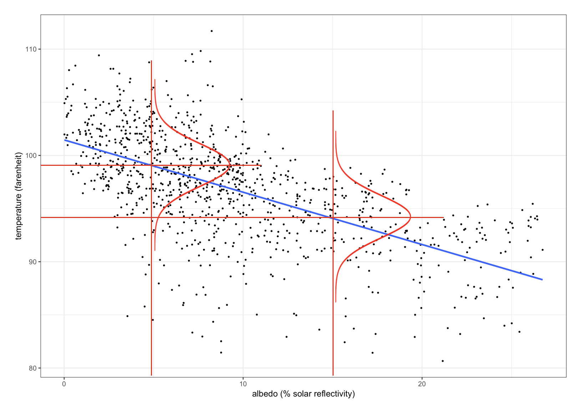

# History of least squares

## A constraint we can place when fitting a line {#og-constraint}

> This exercise shows us that the sum of the residuals is 0 $\iff$ the line
> passes through the point with the average value of `x` and the average value
> of $y$

Suppose $(x_i, y_i)$ are observations we wish to model as

\begin{align*}
y_{i} = \alpha + \beta x_{i} + \epsilon_{i}
\end{align*}

for some unknown optimal values of $(\alpha,\beta)$.  
For a given choice $(\hat{\alpha})$ let $\hat{y}_{i} = \hat{\alpha} +
\hat{\beta}x_{i}$ and $r_{i} = y_{i}  -  \hat{y}_{i}$

**Exercise/constraint**: Show that $\bar r = 0$ if and only if the line $y =
\hat \alpha + \hat \beta x$ passes through the point $(\bar x, \bar y)$.

**Problem**: There are (uncountably) infinitely many solutions with "zero
average error"

For a given $x \neq \bar x$, could predict *any* $y$ with one of these lines.
Any line that passes through this point satisfies this particular constraint
and can predict any value of $y$ given a value of $x$. This is not what we
want.

## Constraints and constrained methods

If the method is mathematically well-defined, producing a unique solution, then
theories formed using that method can be severely tested^[We want a well
defined problem so we can produce a single solution. This is why flexible
models are more difficult to disprove/say there is something absolutely
incorrect with the model].

So we will add some additional constraints to our original constraint of
passing through $(\overline{x},\overline{y})$:

1. The errors sum to 0

### Why squared errors

Of all the alternative measures you could try and minimise, the least squares
is the **most simple**. The other minimisations would lead to very difficult
computations. It is almost tradition to use least squares because it was the
only one remotely computable by hand back in the day.

Another reason we like to use least squares is because it has convenient
geometry.

We want to minimise the residuals because we want to show that the sum of the
residuals is 0 (from the [original constraint](#og-constraint)). We know from
\@ref(eq:regression-intercept) that we can rearrange for the residuals in terms
of $\beta_{0}$^[Here, and often, denoted as $\alpha$], $\beta_{1}$, and $y$.
So, at a minimum of^[This is an objective function as a function of the
intercept and slope that we are going to fit. pretty sure the $l$ is merely
notation name like calling a function $f$]:

\begin{align}
  \ell (\hat{\alpha}, \hat{\beta}) = \sum_i (y_i - \hat{\alpha} - \hat{\beta}
  x_i)^2 (\#eq:min-squared-errors)
\end{align}

Taking the partial derivatives^[A reminder that we set the variable that isn't
in the denominator of the differentiation notation to 0]:

\begin{align*}
  0&= \frac{\partial \ell}{\partial \alpha} = 2 \sum_i r_i\\
  0&= \frac{\partial\ell}{\partial\beta} = 2 \sum_i x_i r_i
\end{align*}

- We see that we have that the sum of residuals is equal to 0
- We thus have **orthogonality**

(**Orthogonality, uncorrelatedness, bias**). Since $\overline{r} = 0$ and $\sum
x_{i}r_{i} = 0$, we also have:

\begin{align*}
  \text{cor}(x,y) = 0
\end{align*}

- Correlation measures ***linear independence***. 
- If we minimised a different loss function^[The name of a function that
  calculates residuals, i.e. the difference between the output of our algorithm
  when given the real data point and the expected output (where the data point
  actually is)] and the resulting residuals were correlated with $x$, this
  would mean there is some remaining (linear) signal, i.e. we still have some
  bias

> Minimising the squared error rules out the systematic bias. As long as we
> minimise the squared error, we will be effectively eliminating bias.

## Risk: probability and loss

### Randomness and probability models

So far we have minimised the squared error on *observed data* (equation
\@ref(eq:min-squared-errors)). If we can introduce a probability model to our
data, some joint distribution $p_{X,Y}(x,y)$ then we can minimise:

\begin{equation}
  \min \mathbb{E}[(Y - \alpha - \beta X)^{2}] (\#eq:ese)
\end{equation}

i.e. minimise the expected squared error because we have made assumptions about
the probability distribution.

### Generative ML^[We will mainly focus on these in this course]

- Models that use probability distributions in machine learning are sometimes
  known as "generative" models beacause they:
  - Model the "data generation pricess" (DGP)
  - Can be used to generate synthetic data

### Conditional distributions

Supervised learning is mostly about modelling the conditional distribution of
the given outcome variable with the feature variables:

\begin{align*}
  p_{Y|X}(y|x) =  p_{X,Y}(x,y) / p_{X}(x)
\end{align*}

Some ML methods try to learn the entire distribution and others focus on a
summary like conditional expectation/conditional quantile:

\begin{align}
  &\text{ conditional expectation } = \mathbb{E}_{Y|X}[Y|X] (\#eq:cef)\\
  &\text{ conditional quantile } = Q_{Y|X}(\pi) \notag
\end{align}

You can visualise conditional distribution on the actual data plot using curves
showing $p_{Y|X}(y|x)$ at two values of $x$ by fixing some value on the
horizontal axis (i.e. this is what is given) and then looking at a probability
distribution above the point on the line of the vertical axis (figure
\@ref(fig:visual-conditional-prob)).

```{r visual-conditional-prob, echo=F, eval=T}
#| fig.cap='Conditional probability visualisation',
#| out.height="30%",
#| fig.align="center",

```

- We can also see the difference between trying to understand the whole
  probability distribution vs just trying to compute a conditional
  distribution. I.e. the regression line gives us one number for any $x$^[i.e.
  $\mathbb{E}_{Y|X}[Y|X]$] but not the distribution around that number, i.e.
  the entire conditional probability distribution.

### Conditional expectation and minimisation of expected squared loss

It can be shown that the conditional expectation function (CEF, \@ref(eq:cef))
minimises the expected squared loss:

\begin{align*}
  f(x) = \text{arg}\underset{g}\min \mathbb{E}_{X,Y}\{ [ Y - g(X) ]^2 \}
\end{align*}

- So, out of all possible functions of $x$^[Provided that it is measurable and
  integerable], the one that **square error in predicting $y$** is the
  conditional expectation of $y$ conditional on $x$.

Similarly, **quantile regression** on the 50% quantile, that loss function is
just the absolute of the loss function:

\begin{align*}
  Q_{Y|X}(0.5) = \arg \min_g \mathbb E_{X,Y} [ |Y - g(X)| ]
\end{align*}

> For other quantiles you must take the absolute loss function and you have to
> tilt it

### Risk `==` expected loss

As see from the examples in the previous section, for a given **loss function**
$L(x,y,g)$, you can find the optimal regression function $f(x)$ by finding the
regression function whihc minimises the risk i.e.:

\begin{align*}
  R(g) = \mathbb{E}_{X,Y}[L(X,Y,g)]\\
  f(x) = \text{ arg }\underset{g}\min R(g)
\end{align*}

- Where $g$ is a function which predicts the value of $y$ from $x$
- The risk of a given function that predicts $y$ from $x$ is its expected loss

In statistical machine learning we can use algorithms like the Law of Large
Numbers, Central Limit Theorem, subsampling. We can do this because
expectations in probability models are the same thing as sums of data sampled
from the probability models:

\begin{align*}
  \mathbb E \longleftrightarrow \dfrac{1}{n}\sum
\end{align*}

### Additional modeling assumptions

We are currently looking at models which assume that the output variable is a
linear function of $x$ or that it can be approximated as a linear function of
$x$:

\begin{align*}
  f(x) := \mathbb E_{Y|X}(Y|X) = \beta_0 + \beta_1 X_1 + \cdots + \beta_p X_p
\end{align*}

> There are no error terms $\epsilon$ in this equation is because this is a
> definition with no estimations and represents the absolute perfect model. In
> reality, there is always going to be some incorrectness in our models in
> general which are corrected by the error term we usually have.
