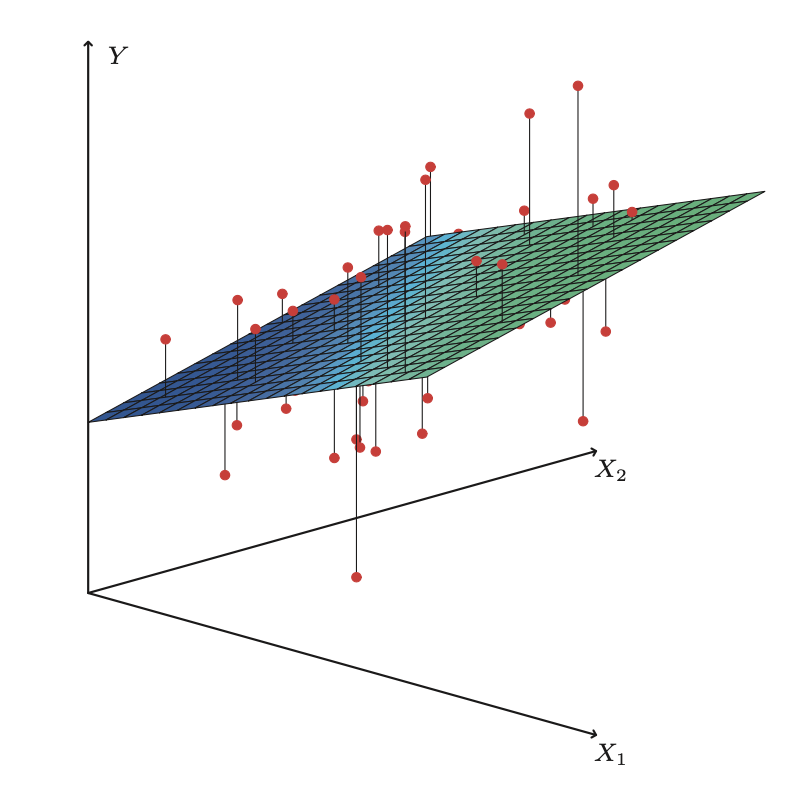

# Multiple regression

Sometimes there are more than one variables that correlate at different
strengths with the output variable.

- For example, if we correlate government welfare with poverty, there may me
  another variable which dictates how much welfare people have to take, i.e.
  age; older people can't work as much so they may need more welfare. It can be
  more than just the fact that people are poor which makes them need welfare
- We need a way to see if the correlation between the $y$ variable is
  attributable to more than one $x$ variable.
- Multiple regression was developed because, if you think about physical
  experiments, you can isolate variables there and come to understand the
  relationship. If you cannot isolate variables it is difficult to understand
  their influence

## When $p$ > 1

When the number of predictor^[dependent] variables $p$ is greater than 1, we
now need to think of our regression not as a line of best fit but instead as a
hyperplane of best fit because we have multiple dependents now (figure
\@ref(fig:multi-reg-plane)).

```{r multi-reg-plane, echo=F,}
#| fig.cap='multi-reg-plane',
#| out.height="30%",
#| fig.align="center",

```

But we are still doing a **least squares regression** so we are choosing the
plane which minimises residuals among all possible hyperplanes.

## Multi linear regression notation

There are various ways to write the formula for a multi regression. The first
is the formula for one observation $i$:

\begin{equation}
  y_{i} = \beta_{0} + \beta_{1}x_{1} + \beta_{2}x_{2} + \dots + \beta_{i}x_{i}
  + \epsilon_{1} (\#eq:multi-regression)
\end{equation}

or the second method which uses a column of vectors and its inner product with
the coefficients:

\begin{align*}
  y_{i} = x_{i}^{T}\beta + \epsilon_{i}
\end{align*}

Or, thirdly we can use what is called "random variable notation" where we
denote all the observations in the set with capital letters:

\begin{align*}
  Y = X^{T}\beta + \epsilon
\end{align*}

And finally, we can also write it out all out once as a matrix which multiplies
together to give all the terms possible^[Two common practices with matrix
notation is to include a column of 1s for the intercept in the observations so
that each observaiton has a $1\times\beta_0$ term. Or alternatively is is
omitted by assuming the $\mathbf{y}$ vector is already centerd, i.e the model's
mean (where the regression line passes through) is 0 so there is no intercept]:

\begin{align*}
  \begin{pmatrix}
    y_1 \\
    y_2 \\
    \vdots \\
    y_n
  \end{pmatrix}
    =
    \begin{pmatrix}
    1 & x_{11} & x_{12} & \cdots & x_{1p}\\
    1 & x_{21} & x_{22} & \cdots & x_{2p}\\
    \vdots & \vdots & \vdots & \ddots & \vdots \\
    1 & x_{n1} & x_{n2} & \cdots & x_{np}\\
  \end{pmatrix}
    \begin{pmatrix}
    \beta_0 \\
    \beta_1 \\
    \vdots \\
    \beta_p
  \end{pmatrix}
    +
    \begin{pmatrix}
    \varepsilon_1 \\
    \varepsilon_2 \\
    \vdots \\
    \varepsilon_n
  \end{pmatrix}
\end{align*}

or:

\begin{align*}
\mathbf{y} = \mathbf{X} \beta + \mathbf{\varepsilon}
\end{align*}

### Other notational conventions

We'll use common conventions in this course:

- **Bold for vectors, bold and upper case for matrices**
- Otherwise upper case *denotes random variable*
- Error terms $\varepsilon = y - \mathbf x^T \beta$ never truly observed
- **Residuals $r = y - \mathbf x^T \hat \beta$ used as a proxy for errors**
- Greek letters like $\beta, \theta, \sigma, \Sigma$ usually *unknown parameters*
- Greek letters with hats like $\hat \beta$ are estimates computed from data
- Roman letters that usually denote functions with hats, like $\hat f$ are also estimates
- Other Roman letters with hats like $\hat y$ are predictions
