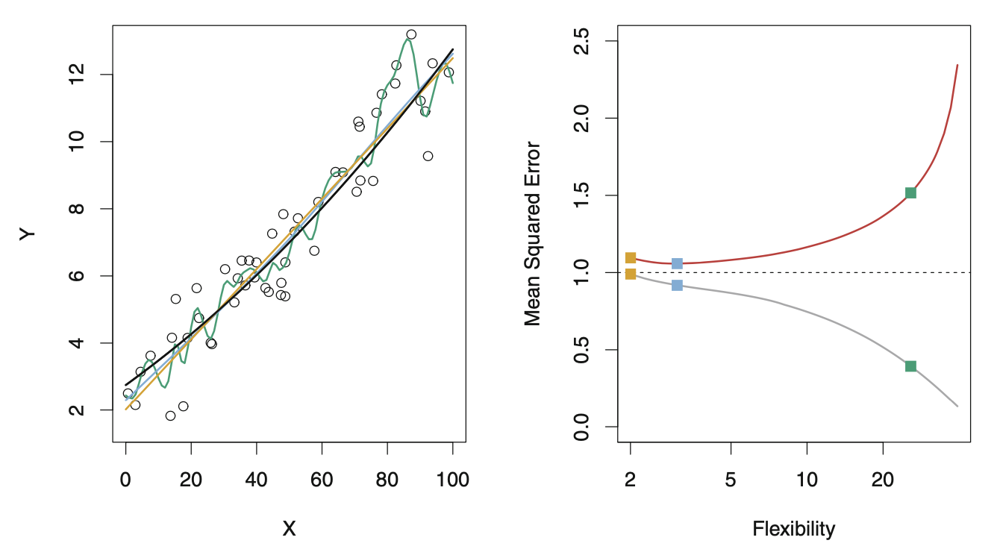

# Overfitting

## What is overfitting

With machine learning, there are loads of ways to increase model complexity.
With his ability and algorithms that allow us to increase complexity, comes the
danger that our model can be too specific for our data. Usually, you can tell
when something is overfitted. But let's develop methods to formally define
overfitting.

## Typical definition of overfitting

The reason we encounter overfitting is because we are usually "deploying our
model". This means that it will be used on datasets that should be
representative of the trained dataset but are not statistically identical. When
we overfit, the complexity level of our model is **higher than it should be**.
We want to know **what level of complexity gives us the lowest for the loss
function on a new observation**.

Let's set out some notation:

- $\hat{f}_{\lambda}$ is our model which is fitted to some training data
- $\lambda$ is a tuning parameter which **penalises complexity**
  - A larger $\lambda$ means a simpler model
- $\lambda^{*}$ is the optimal value for lambda when predicting on new data

With this notation leads us to the conclusion that when we overfit, we have

\begin{align*}
  \lambda < \lambda^{*}
\end{align*}

for some model $\hat{f}_{\lambda}$.

> Figure \@ref(fig:classic-overfitting-exm) shows us an example of overfitting.
> The idea is that some curves are too simple and others are too complex and on
> the left side, we see that the point correcponding to the green curve has a
> low error for the TRAINING DATA than all the other curves but a HIGHER error
> on the test data than the other curves.  
> In machine learning, we don't often end up with models that aren't complex
> enough because there are ways to increase model complexity.

```{r classic-overfitting-exm, echo=F, eval=T}
#| fig.cap='classic-overfitting-exm',
#| out.height="30%",
#| fig.align="center",

```

## Generalisation

Here we want to think about the **probability distribution** of the test data
so that we know how best to fit our models. Where we talk about generalising to
a new observation, we must ask if the observation is from the **same
distribution as the training data**. If we are generalising to the **same**
distribution, we are primarily concerned about variance, whereas if the
distribution is different, we will be concerned with **bias**.

Suppose the training data is sampled IID from

\begin{align*}
  (\mathbf X_1, y_1), (\mathbf X_2, y_2), \ldots, (\mathbf X_n, y_n) \sim F 
\end{align*}

and the test data is sampled IID from

\begin{align*}
  (\mathbf X'_1, y'_1), (\mathbf X'_2, y'_2), \ldots, (\mathbf X'_{n'},
  y'_{n'}) \sim F'$
\end{align*}

In this case we assume **in-distribution (ID) generalisation**: $F = F'$. When
people talk about overfitting, we are usually referring to "in-distribution
generalisation" failure. A larger $n$ allows us to fit more complex models. ID
can usually be fixed by having, for example, a larger training dataset.

In the case of **out-of-distribution (OOD) generalisation** $F\neq F'$. In this
case, we have the problem of bias. It cannot be fixed by having a larger
training dataset but rather by making **modelling assumptions**.
