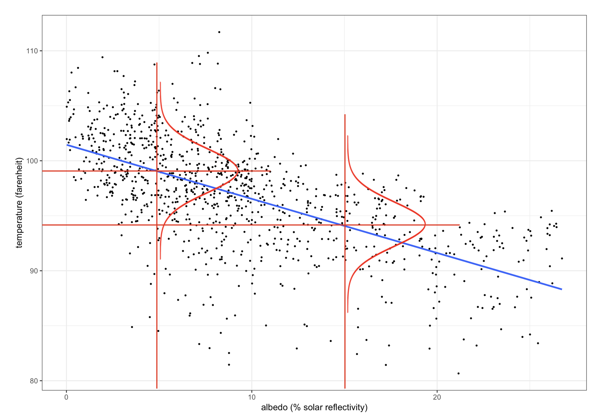

```{r, setup, include=F}
knitr::opts_chunk$set(
  attr.source = ".numberLines", eval = F, warning = F,
  message = F, cache = T
)
```

# Preface {-}

The main readings used in this course are:

- **ISLR** [Introduction to Statistical Learning](https://statlearning.com/) 
- **ESL** [Elements of Statistical Learning](https://web.stanford.edu/~hastie/ElemStatLearn/)
- **CASI** [Computer Age Statistical Inference](https://web.stanford.edu/~hastie/CASI/)
- **Mixtape** [Causal Inference: The Mixtape](https://mixtape.scunning.com/index.html)
- **R4DS** [R for Data Science](https://r4ds.had.co.nz/)

> In this course the textbook readings are required readings but the lecture
> video emphasise themes that complement the textbook

I Like this guy. I wish I had taken this course for real lol :(

## `R` package list

- `tidyverse`: just a bunch of commonly used packages
- `gapminder`: just some random datasets we can use

```{r, eval=T, results=F}
library(gapminder)
library(fivethirtyeight)
library(broom)
library(tidyverse)
```

<!--chapter:end:index.Rmd-->

---
author: "Kamal Sacranie"
numbersections: true
date: "`r format(Sys.time(), '%B %d, %Y')`"
output: bookdown::pdf_document2
---

# (PART) Week 1 {-}

```{r, include=F}
knitr::opts_chunk$set(echo = TRUE)
```

# Simple plotting with `ggplot`

What is the association between GDP and life-expectancy:

```{r, echo=FALSE}
library(gapminder)
library(tidyverse)
```

## Using `ggplot`

::: {.example #gdp-life-exp name="GDP vs life expectancy"}
<br />\hfill\break

::: {.minipage latex-data=""}
```{r yes, fig.cap="The cars data."}
ggplot(
  # Piping to mutate to boolean index the data
  gapminder %>% mutate(
    # Simple boolean logic here and passing it as a kwarg to the mutate
    # function
    indicator = (country == "United Kingdom")
  ),
  aes(x = gdpPercap, y = lifeExp)
) +
  # How the fuck has indicator now got local scope. Was it created by the
  # mutate fucntion. But even then? it's not returning anything, where is
  # idnicator being assigned
  geom_point(aes(color = indicator))
```
:::

:::

---

- `aes` stands for aesthetic and creates an aesthetic mapping between our
  dataset and the aesthetic properties of the plot. It's a function which is
  passed as an in place arg called a `mapping` function
- `aes` takes an x variable and y variable form our dataset as arguments
- `geom_point` is one of the many plots that come with `ggplot` and plots a
  point plot

> The `aes` argument which goes in the first `ggplot` function applier for the
> whole "canvas", whereas the ones for the secondary functions only apply to
> that specific function. So **if you want to apply colour to only the
> regression line, you do the `aes` in the `geom_smooth` function**

In the above example we use the `%>%` operator (provided by the package dyplr).

This is maybe the only good thing about R that I have encoutered. It works
similarly to the pipe character in bash. It takes the return from the last
function pipes it into the first argument of the next function.

> For the record, it is insanely retarded that we can just pass through the
> columns of `gapminder` as if they were variables. We haven't assigned them or
> anything. It's also insane to me that we use ggplot and then ADD A PLOT?? WTF
> does that even mean. Why are these two objects able to be added. How is there
> not a type error

## The pipe `%>%`

As previously mentioned... the only good thing about `R`. Just plugs the data
into the first argument of the next function.

::: {.example #pipe-vs-normal name="Piping to a function"}
<br />\hfill\break

```{r}
gapminder %>% nrow()
```

is the same as

```{r}
nrow(gapminder)
```

:::

---

This is often what `R` uses to stack things. It's basically becasue `R` is made
by people who are too retarded to read regular nested code or even just regular
lines of code.

## Filtering for a value in column (basically boolean indexing)

```{r}
# notice that we can pass a straight int here. R knows the type in the column
base_plot <- ggplot(
  # Easier to see here that mutate basically adds a column with a boolean value
  # showing whether it's the UK or not
  filter(gapminder, year == 2007) %>%
    mutate(indicator = (country == "United Kingdom")),
  aes(x = gdpPercap, y = lifeExp)
) + # The plus is similar to the pipe, it is introduces by ggplot and basically
  # allows you to build layers on your plot
  geom_point(aes(color = indicator))
```

- The `+` is like ggplot's version of the pipe. It's used to layer graphs
- `indicator` is accessable because it's a column of our `gapminder` data which
  is being pushed through with our plus

```{r}
base_plot +
  geom_smooth()
```

- The line curves around the points and fits locally to the points
- The gray area is the confidence intreval of the fit line

## Model objects

Everything is an object in `R` and our assignment operator is `<-`:

```{r}
gm_2007 <- gapminder %>%
  filter(year == 2007)
```

Great so we can use that everywhere in this `R` file. For example, we can use
the `lm` function for fitting models

::: {.example #lm-basic-fit name="A basic model function use"}
<br />\hfill\break

```{r}
gm_lm <- lm(lifeExp ~ gdpPercap, data = gm_2007)
```

:::

---

> A common way for model funciton to work in `R` is to require the assignment
> of the lefthand side and the right hand side variables; we see this in
> \@ref(exm:lm-basic-fit) with the use of the `~`. On the left of the tilde we
> have the dependent (outcome) variable and on the right we have the
> independent (predictor) variable

In \@ref(exm:lm-basic-fit) `lm` stands for linear model (a regression) and is
an object which contains all the information for our regression. When you print
it on its ones, there isn't much you can do

```{r}
summary(gm_lm)
residuals(gm_lm) # the difference in the predicted values and the actual
predict(gm_lm)
```

- `summary` is a builtin function which displays a summary **of any model
  object in `R`**
- This also shows us standard errors, p-values, etc.

> Something I find weird here is that all the data we need is inside the `lm`
> object but instead of using a method to produce the result like I would
> expect, we have to pass it to another function

## `broom`

`broom` is just a library that provides nice out of the box rendering for `R`'s
model objects.

```{r}
library(broom)
```

```{r}
tidy(gm_lm)
```

- The `broom::tidy` function is really nice for making tables look good
- Don't think it works in latex though

We also have the `broom::glance` function which shows our most important values
at a glance. You can also compare two models with it:

```{r}
glance(gm_lm)
```

The last main fucntion from `broom` is `augment`. This gives us the original
dataset back plus the extra rows like standard errors for residuals, residuals,
etc. This function is really useful for plotting the results of the model

```{r}
augment(gm_lm) %>%
  ggplot(aes(x = gdpPercap, y = lifeExp)) +
  geom_point() +
  # the geom line adds a line to the plot on top of the already existing plot,
  # i.e. we can give it a different x and y to plot via the aes which returns a
  # mapping
  geom_line(aes(x = gdpPercap, y = .fitted))
```

- Note here how ggplot basically crease the canvas for the plot. Then you layer
  on a point distribution using the data, then you layer on a line using the
  data and specifying the variable you want. In this case `.fitted` will give
  us all the points on the fitted line. This is the same as using ggplot's
  `geom_smooth` function. We are just doing it the long way around

## Subbing out function for e.g. `loess`

The most important takeaway here is the idea of **model flexibility**. We have
made a robust programme which let's us swap in and out functions. For example,
let's use the `loess` function to plot the local extimation line which is the
default given by ggplot's `geom_smooth`

```{r}
gm_loess <- loess(lifeExp ~ gdpPercap, data = gm_2007, span = .5)
summary(gm_loess)
```

- Again, we see the tilde notation for specifying LHS and RHS
- An interesting note. When I ran what I thought was known as the `tidy`
  **function**, `R` threw an error mentioning loess object doesn't have the
  method `tidy`. I.e. methods are defined in objects but somehow they are
  called with function notation.

::: {.example #loess name="loess example"}
<br />\hfill\break

```{r}
augment(gm_loess) %>%
  ggplot(aes(gdpPercap, lifeExp)) +
  geom_point() +
  geom_line(aes(gdpPercap, .fitted))
```

:::

---

### What is `loess` actaully doing

`loess` stands for "locally estimated scatter-plot smoothing". If we look at
the output of exmaple \@ref(exm:loess), we see that it is looking at the local
points and approximating them. `loess` has some options, for example:

- `span`: tells the function how localised to make its approximation

<!--chapter:end:01-introduction-to-r.Rmd-->

---
author: "Kamal Sacranie"
numbersections: true
date: "`r format(Sys.time(), '%B %d, %Y')`"
output: bookdown::pdf_document2
---

# Candy rankings

```{r, include=F}
library(plotly)
library(broom)
library(fivethirtyeight)
library(tidyverse)
```

It's always good practice to start by visualising some of your data. For fun
let's just fit a simple linear model to this dataset:

```{r}
cr_lm <- lm(pricepercent ~ winpercent, data = candy_rankings)
tidy(cr_lm)
```

```{r}
augment(cr_lm) %>%
  ggplot(aes(x = pricepercent, y = winpercent)) +
  geom_point() +
  geom_line(aes(y = .fitted))
```

- Nice tip with `geom` functions is that because it take in the object the
  previous function returns, you can keep the `x` value the same and reassign
  the `y`

## Adding a categorical variable to our model

```{r}
cr_lm_cat <- lm(winpercent ~ pricepercent + chocolate, candy_rankings)
tidy(cr_lm_cat)
```

- Here in the `formula` argument, we add the categorical variable `chocolate`
- This becomes a dummy variable for our regression model (`chocolateTRUE`)

Let's now represent this new categorical variable on our plot through the use
of colour:

```{r}
augment(cr_lm_cat) %>%
  ggplot(aes(
    x = pricepercent,
    y = winpercent,
    color = chocolate,
    shape = chocolate,
    linetype = chocolate
  )) +
  geom_point() +
  geom_line(aes(y = .fitted))
```

- So in the `aes` function we have a whole load of arguments which take a set
  of true or false values to boolean index the characteristics of the data

## Adding a continuous predictor and creating a 3D plot

A common package used to create 3D plots is `plotly`. 

```{r}
candy3d <- plotly::plot_ly(candy_rankings,
  x = ~pricepercent, y = ~sugarpercent,
  z = ~winpercent,
  type = "scatter3d"
)
```

> This is a perfect example of how `R` is so good out the box for data
> visualisation

We can fit our regression plane in this three dimensional space:

```{r}
cr_lm_sugar <- lm(
  winpercent ~ pricepercent + sugarpercent,
  data = candy_rankings
)

xy_plane <- expand.grid(0:100, 0:100) / 100
ps_plane <- xy_plane %>%
  rename(pricepercent = Var1, sugarpercent = Var2)

lm_plane <- augment(cr_lm_sugar, newdata = ps_plane)
lm_matrix <- matrix(lm_plane$.fitted, nrow = 101, ncol = 101)

candy3d %>%
  add_surface(
    x = ~ (0:100) / 100,
    y = ~ (0:100) / 100,
    z = ~lm_matrix
  )
```

- The `expand.grid` function creates a data frame from all combinations of the
  supplied vectors or factors
- We then rename the variable of the plane with `rename`
- We then see the `augment` function in use 


<!--chapter:end:02-more-involved-models.Rmd-->

# Machine learning applications

Some examples of machine learning are:

- Scraping social-media to predict period of unrest before it happens
- Using health records to predict which patients will require more care
- Algorithms which collect data to adapt

Basically any predictive model that uses data to predict the future. In this
course we focus on the underlying theory of how the methods function.

> The difference between AI and ML, is that AI allows us to get mathematical
> relationships from data that is unstructure, non-mathematical. This could be
> images etc. Contrasting this with what we did in section
> \@ref(simple-plotting-with-ggplot) where our inputs were very mathematical
> and numerical. In this course **when we refer to data, we are already talking
> about vectorised, structured data**

## Abstraction and notation

In an abstract sense, the data we look at is formatted as a collection of $p$
district **variables**^[Think columns of your data]:

\begin{align*}
  X = (X_1, X_2, \ldots, X_p) \in \mathbb{R^{p}}
\end{align*}

- We assume each **observation is a point in the vectors space**
  $\mathbb{R^{p}}$
- We also assume that $p$ is finite

**Supervised learning**: if we think of an application for ML which has a clear
$Y$ variable defined, i.e. the outcomes^[Sometimes called responsive] of the
model, the we are dealing with supervised learning.

**Unsupervised learning**: if there is no natural outcome variable $Y$, then we
are dealing with unsupervised learning. This is where you try and create a
mathematical relationship out of unstructured data.

### Sub categories of supervised ML

Common cases:

- If $Y$ is numeric: **regression**
- If $Y$ is categorical: **classification**

Special cases:

- $Y$ is binary with rare cases, e.g. anomaly detection
- $Y$ is a time to event, survival analysis
- Multi-class, hierarchical classes, etc

## How to predict $Y$ from $X$

- We want to estimate $\exists f$ such that the graph of the function $y =
  f(x)$ fit the data perfectly^[Fundamental idea of regression]
- **Problem**: what if $(x_1, y_1) = (1, 0)$ and $(x_2, y_2) = (1, 1)$?
- **Problem**: even our most tested and verified physical laws won't fit data
  perfectly

Even if we are thinking about cases where our data is supposed to follow a
well-defined law, upon measuring we will often see that this doesn't quite
work.  
The **solution** to this problem is to have an error term. For any function
$f$, we can always get the residuals:

\begin{align*}
  \epsilon\equiv y - f(x)
\end{align*}

- $y$ is the actual observation and we deduct the predicted value to see our
  residual (error)

***We want a function which minimises error.***

The simplest way to minimise this error is to find out which function decreases
our squared error^[This is premised on the fact that $\epsilon$ has some sort
of probability distribution so we can predict it]. A good function is defined
as:

\begin{align*}
  \mathbb{E}[\epsilon^2] = \mathbb{E}\{[Y - f(X)]^2\}
\end{align*}

This motivates the **plug-in principle**: compute an *estimate* $\hat{f}$ of
the good function $f$ by solving the corresponding problem on the dataset,
i.e.:

\begin{align*}
  \min\sum_{i = 1}^{n}\left[y_{i} - \hat{f}(s_{i})\right]^{2}
\end{align*}

> Basically, there is this perfect function out there $f$. It is almost
> impossible to arrive at that function so we have to calculate $\hat{f}$ which
> minimises our error and approximates our perfect function.

## Bias-variance trade-off

Errors that are systematic are bias in the system. The bias-variance trade-off
is formally described as follows:

\begin{equation}
  \mathbb{E}\{[Y - \hat{f}(X)]^{2}\} = \text{Var}(\hat{f}) +
  \text{Bias}(\hat{f})^{2} (\#eq:bias-var-to)
\end{equation}

- The expected error of our function is a combination of bias and variance

Combining this idea of BV trad-off with our idea of model complexity, we
typically see that **more complex models have lower bias and higher variance**.

Typical there is a sweet spot for complexity

Figure \@ref(fig:complexity-variance) shows us a great preview between a more
complex model which visually even has more variance and a less complex model
which doesn't deviate too much but as such has more bias.

```{r complexity-variance, echo=FALSE, eval=T}
#| out.width="40%",
#| fig.cap='complexity-variance',
#| fig.show='hold',
#| fig.align="center"
knitr::include_graphics(
  c(
    "./assets/03-machine-learning-applications/img/2022-01-23-02-58-55.png",
    "./assets/03-machine-learning-applications/img/2022-01-23-02-59-17.png"
  )
)
```

- It is difficult to tell visually which model is better

## Evaluation: mean squared error

It is extremely easy to evaluate MSE in `R`. You use the `residuals` function
which takes a `model` object as an argument:

```{r}
c(
  mean(residuals(gm_simple)^2),
  mean(residuals(gm_complex)^2)
)
```

`candy_rankings` models:

```{r}
c(
  mean(residuals(candy_simple)^2),
  mean(residuals(candy_complex)^2)
)
```

- These variables we are passing through are object from a model function like
  `lm`
- The above results would show us that the more complex models have lower MSE.
  This is mostly true because your function better approximates the data. But
  this is where the question of overfitting comes into play because if we use
  that same function on a new set of data, we could get completely wrong
  results

<!--chapter:end:03-machine-learning-applications.Rmd-->

# Seminar 1

This seminar is insanely basic. Probably nothing to write down.

<!--chapter:end:04-seminar-1.Rmd-->

# (PART) Week 2 {-}

# Regression part I

```{r, include=F}
library(tidyverse)
library(gapminder)
library(broom)
```

## Estimation

We begin by fitting our data to our standard linear regression model using
`lm`:

```{r gapminder-scatter, fig.cap="GGPlot point plot", eval=T}
gm2007 <- filter(gapminder, year == 2007)
gm_lm <- lm(lifeExp ~ gdpPercap, data = gm2007)
print(gm_lm)
ggplot(gm2007, aes(x = gdpPercap, y = lifeExp)) +
  geom_point() +
  geom_smooth(method = "loess")
```

### Regression breakdown

However, let's break down what the `lm` function does under the hood. The basic
regression model is:

\begin{equation}
  \hat{\beta}_{1} = \text{cov}(x,y)\dfrac{\sigma_{y}\sigma_{x}}{\sigma_x}
  (\#eq:beta)
\end{equation}

- $y$ goes in the numerator because if you outcome variable *has a larger
  spread*^[i.e. a higher standard deviation], then the slop has to be steeper
- $x$ is in the denominator because the horizontal axis variance leads to the
  line being less steep

We can calculate equation \@ref(eq:beta) by hand in $R$ as follows^[This is
also a "tidyverse way" of calculating statistics]. First the regular way:

```{r}
cor(gm2007$gdpPercap, gm2007$lifeExp)
sd(gm2007$gdpPercap)
```

- We see that we have to pass in our column for every summary statistic

`tidyverse` provides function which lets us only pass the data through one and
then essentially makes each column into a variable the function can access. 
Basically syntactical sugar:

```{r}
summarize(gm2007,
  cor_xy = cor(gdpPercap, lifeExp),
  sd_x = sd(gdpPercap),
  sd_y = sd(lifeExp),
  hat_beta1 = cor_xy * sd_y / sd_x
)
```

- The usefulness of summarise is that you can do this for any function applied
  to your varaibles is that you can do this for any function applied to your
  varaibles
- `summarize` basically creates those variables which we passed in as kwargs
- Note that we can just calculate beta there and then within the function using
  the previously defined variables in the call of the function
- `hat_beta1` is the same slope as calculated by `lm`

To calculate the intercept, we know that the regression line passes through

\begin{align*}
  (\overline{x},\overline{y})
\end{align*}

- i.e. the line passes through the point that is the **mean of the dataset**

which means that $\overline{y}$ is calculated with the estimated slope,
intercept and $\overline{x}$. So we can rearrange for $\hat{\beta}_0$:

\begin{equation}
  \begin{aligned}
    \overline{y}&= \hat{\beta}_0 + \hat{\beta}_1 \overline{x}\\
    \hat{\beta}_0&= \overline{y} - \hat{\beta}_1 \overline{x} (\#eq:intercept)
  \end{aligned}
\end{equation}

We can of course do this again with the `summarise` function:

```{r}
summarise(gm2007,
  cor_xy = cor(gdpPercap, lifeExp),
  sd_x = sd(gdpPercap),
  sd_y = sd(lifeExp),
  hat_beta1 = cor_xy * sd_y / sd_x,
  xbar = mean(gdpPercap),
  ybar = mean(lifeExp),
  hat_beta0 = ybar - hat_beta1 * xbar
)
```

> You should be able to reproduce these basic regression formulas by heart

We can the give a numerical value of certainty ($p$-value) which tells us how
certain we are that our model is correct. This is done by first calculating the
standard errors of the slop $\hat{\beta}_{1}$:

\begin{equation}
  \begin{aligned}
    \text{SE}(\hat \beta_1) = \sqrt{\frac{\sigma^2}{\sum_{}((x_i - \bar x)^2)}}\\
    \text{se}(\hat \beta_1) = \frac{\hat \sigma}{\sqrt{\sum_{}((x_i - \bar
    x)^2)}}
    (\#eq:se-beta1)
  \end{aligned}
\end{equation}

- The $\sigma^{2}$ here represents the variance of the $\epsilon$s in the model
  which are irreducible
- **If there is more variance in our errors** then the standard error
  increases^[You can think of this as how far
  away the points are from our regression line]
- The denominator here is the **how much spread there is in the $x$ variable**.
  Think of "how much information there is in the $x$ variable". If the $x$
  values are all very close to each other **there is lower variance**^[In this
  instance, information is the recirical of variance here] which means there is
  less information in our $x$ variable so our standard error increases
- I like to think of it like a standardised proportion of $\epsilon$ variance
  to how much variance there is in our $x$ variable^[Like, if there is low
  variance in our $x$ we would need a low variance in our errors in order for
  the estimated coefficient to be a good predictor]

If we look at the summary of the linear model which was produced by
`R`^[rendered here with the `tidy` function instead of `summary` because it
looks nicer]

```{r}
tidy(gm_lm)
```

- The value we are looking at the estimated coefficients and their standard
  errors. We want to see if we can calcualate, using equation
  \@ref(eq:se-beta1), the standard error of the estimated coefficient^[In the
  column `estimate`]

We need to estimate $\sigma^{2}_{\epsilon}$ by using the standard error of the
residuals (RSE)^[This is because the errors are not continuous data and we only
have a finite number of points so we need an estimator]:

\begin{align}
  \hat \sigma = \text{RSE} = \sqrt{\frac{\text{RSS}}{n-2}}
  (\#eq:rse)
\end{align}

- Where the RSS is the sum of the squared differences between our model fit
  line and the points?

We can calculate the RSS via the `broom` packages function `augment` which adds
the residual for each element. We can then sum all of those squared residuals
to get RSS to calculate our $\text{ RSE } = \hat{\sigma}$ using equation
\@ref(eq:rse):

```{r}
augment(gm_lm) %>%
  summarise(
    RSS = sum(.resid^2), # Summing all the squared residuals
    RSE = sqrt(RSS / (n() - 2)),
    # Calculating standar error
    std.err = RSE / sqrt(sum((gdpPercap - mean(gdpPercap))^2))
  )
```

- The function `n` here calculates the sample size of our group

### Regressing over the whole dataset and not just the `gm2007` subset using `group_by`

We can use the entire dataset and **group by a given variable** with the
following:

```{r, eval=T}
gapminder %>%
  group_by(year) %>%
  summarise(
    cor_xy = cor(gdpPercap, lifeExp),
    sd_x = sd(gdpPercap),
    sd_y = sd(lifeExp),
    hat_beta1 = cor_xy * sd_y / sd_x,
    xbar = mean(gdpPercap),
    ybar = mean(lifeExp),
    hat_beta0 = ybar - hat_beta1 * xbar
  ) %>%
  knitr::kable(booktabs = T)
```

- `group_by` basically slices and dices our dataset into the group we provide
  and then the summarise allows us to run the summary statistics on each one of
  those groups
- The output here shows us the `hat_beta1` isn't very stable over time

## Model diagnostics

Diagnostics for regression include $R^{2}$ and the RSE.

### $R^{2}$

#### Simple linear regression $R^{2}$

The `glance` function from the `broom` package outputs the $R^{2}$ and adjusted
$R^{2}$ for a model:

```{r, eval=F}
glance(gm_lm)
```

If we want to calculate this ourself, we need to use the $R^{2}$ calculation
for a SIMPLE linear regression^[One intercept and one dependent variable:
$Y=\beta_0+beta_1x_1$] which is:

\begin{align*}
  R^{2} = \text{cor}(x,y)^{2}
\end{align*}

- I.e. it's just the correlation of our two variables squared. This is only in
  the case of a SIMPLE REGRESSION

We can easily calculate this with `R`:

```{r}
cor(gm2007$gdpPercap, gm2007$lifeExp)^2
```

#### General linear regression $R^{2}$

The general formula for $R^{2}$ is:

\begin{align}
  R^{2} = 1 - \dfrac{RSS}{TSS}
\end{align}

- That is, $R^{2}$ is the proportion of the RSS to the TSS^[Total sum of
  squares].

> We commonly call this the explanation power of our model. It is the
> proportion of our sum of squares of residuals to the total sum of squares of
> our $Y$ variable, i.e. all the values less their means (i.e. the "centred"
> values) squared and the summed up
>
> \begin{align*}
    TSS = \sum(y - \overline{y})^{2})
  \end{align*}

In `R` we can just calculate this with `tidyverse::augment`^[Giving us the
residuals] and `summarise`:

```{r}
augment(gm_lm) %>%
  summarise(
    RSS = sum(.resid^2),
    TSS = sum((lifeExp - mean(lifeExp))^2),
    R2 = 1 - RSS / TSS
  )
```

### Pattern searching in residuals

We want to look for patterns in residuals because of variance-bias
decomposition from equation \@ref(eq:bias-var-to). We have parts of errors that
are systematic (bias) and idiosyncratic (variance). In any given problem there
is inherent variability but we should be controlling for as much bias as
possible. We do this by *looking for pattern in the residuals* as systemic
errors can show up in residuals.

Let's plot the residuals to see if we notice anything:

```{r, eval=T}
augment(gm_lm) %>%
  ggplot(aes(gdpPercap, .resid)) +
  geom_point()
```

- This plot shows the residuals for the 
- This plot can show us some serious problems we can see that there is **one
  large cluster of points on the left side and a trend** on the left side of
  the plot which clearly has a downward sloping trend. The residual are
  becoming more negative as `gdpPercap` increases.

> REMINDER: residuals are the DIFFERENCE between the actual values, and the
> values our model spits out. I.e. the distance of the points from the line of
> best fit. Because our line is essentially a continuous set of points.

<!--chapter:end:05-simple-regression.Rmd-->

# History of least squares

## A constraint we can place when fitting a line {#og-constraint}

> This exercise shows us that the sum of the residuals is 0 $\iff$ the line
> passes through the point with the average value of `x` and the average value
> of $y$

Suppose $(x_i, y_i)$ are observations we wish to model as

\begin{align*}
y_{i} = \alpha + \beta x_{i} + \epsilon_{i}
\end{align*}

for some unknown optimal values of $(\alpha,\beta)$.  
For a given choice $(\hat{\alpha})$ let $\hat{y}_{i} = \hat{\alpha} +
\hat{\beta}x_{i}$ and $r_{i} = y_{i}  -  \hat{y}_{i}$

**Exercise/constraint**: Show that $\bar r = 0$ if and only if the line $y =
\hat \alpha + \hat \beta x$ passes through the point $(\bar x, \bar y)$.

**Problem**: There are (uncountably) infinitely many solutions with "zero
average error"

For a given $x \neq \bar x$, could predict *any* $y$ with one of these lines.
Any line that passes through this point satisfies this particular constraint
and can predict any value of $y$ given a value of $x$. This is not what we
want.

## Constraints and constrained methods

If the method is mathematically well-defined, producing a unique solution, then
theories formed using that method can be severely tested^[We want a well
defined problem so we can produce a single solution. This is why flexible
models are more difficult to disprove/say there is something absolutely
incorrect with the model].

So we will add some additional constraints to our original constraint of
passing through $(\overline{x},\overline{y})$:

1. The errors sum to 0

### Why squared errors

Of all the alternative measures you could try and minimise, the least squares
is the **most simple**. The other minimisations would lead to very difficult
computations. It is almost tradition to use least squares because it was the
only one remotely computable by hand back in the day.

Another reason we like to use least squares is because it has convenient
geometry.

We want to minimise the residuals because we want to show that the sum of the
residuals is 0 (from the [original constraint](#og-constraint)). We know from
\@ref(eq:regression-intercept) that we can rearrange for the residuals in terms
of $\beta_{0}$^[Here, and often, denoted as $\alpha$], $\beta_{1}$, and $y$.
So, at a minimum of^[This is an objective function as a function of the
intercept and slope that we are going to fit. pretty sure the $l$ is merely
notation name like calling a function $f$]:

\begin{align}
  \ell (\hat{\alpha}, \hat{\beta}) = \sum_i (y_i - \hat{\alpha} - \hat{\beta}
  x_i)^2 (\#eq:min-squared-errors)
\end{align}

Taking the partial derivatives^[A reminder that we set the variable that isn't
in the denominator of the differentiation notation to 0]:

\begin{align*}
  0&= \frac{\partial \ell}{\partial \alpha} = 2 \sum_i r_i\\
  0&= \frac{\partial\ell}{\partial\beta} = 2 \sum_i x_i r_i
\end{align*}

- We see that we have that the sum of residuals is equal to 0
- We thus have **orthogonality**

(**Orthogonality, uncorrelatedness, bias**). Since $\overline{r} = 0$ and $\sum
x_{i}r_{i} = 0$, we also have:

\begin{align*}
  \text{cor}(x,y) = 0
\end{align*}

- Correlation measures ***linear independence***. 
- If we minimised a different loss function^[The name of a function that
  calculates residuals, i.e. the difference between the output of our algorithm
  when given the real data point and the expected output (where the data point
  actually is)] and the resulting residuals were correlated with $x$, this
  would mean there is some remaining (linear) signal, i.e. we still have some
  bias

> Minimising the squared error rules out the systematic bias. As long as we
> minimise the squared error, we will be effectively eliminating bias.

## Risk: probability and loss

### Randomness and probability models

So far we have minimised the squared error on *observed data* (equation
\@ref(eq:min-squared-errors)). If we can introduce a probability model to our
data, some joint distribution $p_{X,Y}(x,y)$ then we can minimise:

\begin{equation}
  \min \mathbb{E}[(Y - \alpha - \beta X)^{2}] (\#eq:ese)
\end{equation}

i.e. minimise the expected squared error because we have made assumptions about
the probability distribution.

### Generative ML^[We will mainly focus on these in this course]

- Models that use probability distributions in machine learning are sometimes
  known as "generative" models beacause they:
  - Model the "data generation pricess" (DGP)
  - Can be used to generate synthetic data

### Conditional distributions

Supervised learning is mostly about modelling the conditional distribution of
the given outcome variable with the feature variables:

\begin{align*}
  p_{Y|X}(y|x) =  p_{X,Y}(x,y) / p_{X}(x)
\end{align*}

Some ML methods try to learn the entire distribution and others focus on a
summary like conditional expectation/conditional quantile:

\begin{align}
  &\text{ conditional expectation } = \mathbb{E}_{Y|X}[Y|X] (\#eq:cef)\\
  &\text{ conditional quantile } = Q_{Y|X}(\pi) \notag
\end{align}

You can visualise conditional distribution on the actual data plot using curves
showing $p_{Y|X}(y|x)$ at two values of $x$ by fixing some value on the
horizontal axis (i.e. this is what is given) and then looking at a probability
distribution above the point on the line of the vertical axis (figure
\@ref(fig:visual-conditional-prob)).

```{r visual-conditional-prob, echo=F,}
#| fig.cap='Conditional probability visualisation',
#| out.height="30%",
#| fig.align="center",

```

- We can also see the difference between trying to understand the whole
  probability distribution vs just trying to compute a conditional
  distribution. I.e. the regression line gives us one number for any $x$^[i.e.
  $\mathbb{E}_{Y|X}[Y|X]$] but not the distribution around that number, i.e.
  the entire conditional probability distribution.

### Conditional expectation and minimisation of expected squared loss

It can be shown that the conditional expectation function (CEF, \@ref(eq:cef))
minimises the expected squared loss:

\begin{align*}
  f(x) = \text{arg}\underset{g}\min \mathbb{E}_{X,Y}\{ [ Y - g(X) ]^2 \}
\end{align*}

- So, out of all possible functions of $x$^[Provided that it is measurable and
  integerable], the one that **square error in predicting $y$** is the
  conditional expectation of $y$ conditional on $x$.

Similarly, **quantile regression** on the 50% quantile, that loss function is
just the absolute of the loss function:

\begin{align*}
  Q_{Y|X}(0.5) = \arg \min_g \mathbb E_{X,Y} [ |Y - g(X)| ]
\end{align*}

> For other quantiles you must take the absolute loss function and you have to
> tilt it


<!--chapter:end:06-history-ls-risk.Rmd-->


<!--chapter:end:07-topic.Rmd-->


<!--chapter:end:08-topic.Rmd-->


<!--chapter:end:09-topic.Rmd-->

# Quesitons

- Where the RSS is the sum of the squared differences between our model fit
  line and the points? \@ref(eq:rse)
- What the hell is going on in \@ref(why-squared-errors). In terms of
  orthogonality

<!--chapter:end:98-questions-to-ask.Rmd-->

# `R` notes^[These are probably temporary and will go into own book]

> This is the more general stuff that isn't categorisable into the lecture
> work. For specific `R` functions just look at the coursework in the root
> directory of the course

## Using the `R` repl

To use the `R` repl, you just

```{bash}
R
```

type `R` on the command line. This launches the `R` repl and you can write any
code you want. I.e. when you want to install a package, you can use the repl

## Managing packages

To install a package in `R`, you use the install object:

```{r}
install.packages({
  package:string
})

# For example installing renv for virtual environments
install.packages("renv")
```

- You pass the name of your package as the argument as a string

## `R` virtual environments

You don't want global packages everywhere, some of them will only be useful for
particular projects. Queue `renv`, the `R` virtual environment manager.

To create a virtualenv, go into the root of your project directory and run

```{r create-venv}
renv::init()
```

to initialise your virtual environment.

- You should create your `.gitignore .Rbuildignore`, and `.Rprofile` files
  before running this because it auto updates them

You can then install packages as usual and once you have completed your
project, you can use `renv::snapshow()` to write the dependencies to the
`renv.lcok` file.^[Note that this only writes the libraries you call in your
code. So without a project, you will not have any dependencies]

### LSP in virtual environments

Just spent ages trying to figure out why my LSP wasn't picking up my
virtualenv. It was because the `R` package `languageserver` must be installed
in the virtualenv in order for neovim to find the script to execute.

LSP has:

- Formatting
- Completion

## Loading with the library command

Note: in \@ref(r-virtual-environments) we preface the `init()` command with `renv::` denoting that we want
to use the `init()` command from that specific package. If we were running a
command constantly, we could use:

```{r}
library(renv)
init()
```

to **bring all the function from the `renv` package into our environment's
scope**.

## Environemnt variables

You can get and set environemnt variables with:

```{r}
Sys.getenv()
Sys.setenv()
```

To remove an envrionement variable you can use:

```{r}
Sys.unsetenv()
```

## Viewing `R` documentation

In `R`, if you want any documentation, you just need to preface the command
with a question mark:

```{r}
?install
```

- Note that we don't call the function when we ask for help

## The `select` function

You can use the `select` function to select/deselect rows from your model:

```{r}
subset <- select(my_data, -"name of column")
```

## Indexing in `R`

Indexing in `R` is pretty similar to something like `pandas`. If I have a
dataset I can index it in one of two way. The first:

```{r}
myplot[5, ]
myplot[, 5]
myplot[2, 5]
myplot[2:4, 5:7]
myplot[myplot[, 5] == 7, 5]
```

- Line 1 returns row 5 and all columns
- Line 2 returns column 5 with all rows
- Line 3 returns cell from column 5 row 2
- Line 4 returns the cells in rows 2 to 4 and columns 5 to 7^[Not sure if it's
  inclusive or not]
- Line 5 return the rows in column 5 which have a value of 7

> Data indexing in `R` is always [<rows>, <cols>]

The second way is with the `$` operator:

```{r}
mydata[mydata$year == 2020, ]
```

- This will return all columns for the rows that contain 2020

### The `tidyverse` way of indexing

This is quite a javascript way of doing things. We use the `filter` function,
much like you would use it in js

```{r}
filter(dataset, c(year == 2000, continent == "Asia", ...))
```

## Miscellaneous tips

### Viewing your dataset in a spreadsheet-like manner

```{r}
View(<dataset>)
```

### Generating a polynomial

You can generate a polynomical using:

```{r}
poly({datacolumn}, {polynomial degree})
```

- This will basically plot a standard polynomial for the `x` data values
  (vector?) that you pass as an arg.

### Adding cols onto a dataframe

You can use `augment` to add columns onto a dataframe

```{r}
augment(my_df, newdata = newdf)
```

### Including all variables in your model

The shorthand to inlcude all the variables in your dataset in your model is:

```{r}
lm(y ~ ., data = my_data)
```

What you need to avoid here though is using a variable which is unique to every
piece of data, like brand, etc.

<!--chapter:end:99-R.Rmd-->

